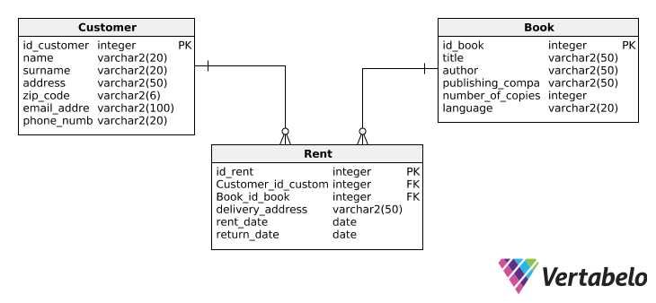

# TIN
PJWSTK : Internet Technologies

# MP0 - project definiton


# MP1 - static FrontEnd version
[frontEnd with client based validation](MP1)

# MP2 - server based version
[Express framework based app with server based validation](MP2)

How To Use:
1. open [docker-compose.yml](MP2/tin-projekt-kaminski-s18610/docker/docker-compose.yml) and set connection ports
2. run db server and app server:
```
cd [project location]
cd docker
docker-compose up
cd ..
npm start
```
3. open http://localhost:3000/ to see the app
4. open http://localhost:(PORT FOR PHPMYADMIN)/ to manage db stuff
5. login to phpMyAdmin (mysql, root, root) [sequelize](MP2/tin-projekt-kaminski-s18610/config/sequelize/sequelize.js)
